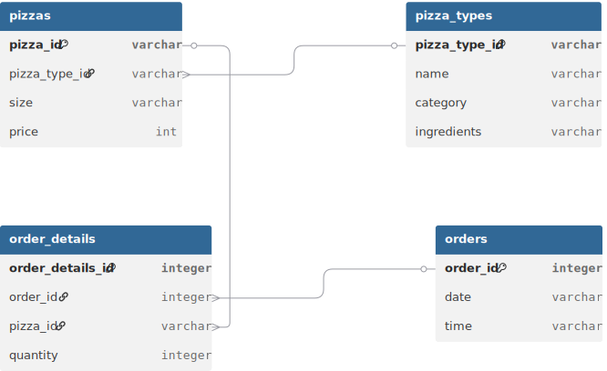

# 🍕pizzahut-analysis-pgsql - Анализ Pizzahut с помощью PgSQL


## 🧑‍💻 **Контрибьюторы**
- **WhosArt**: Разработчик и аналитик данных.
- **Особая благодарность** [Shubham Gupta](https://github.com/iguptashubham) за предоставленные данные!

---

## 📚 **Ресурсы и ссылки**
- 📊 [Github: Датасет на Github](https://github.com/iguptashubham/pizzahut-analysis-sql/blob/main/pizzahut_data.zip)
- 🔗 [GitHub Репозиторий](https://github.com/WhosArt/pizzahut-analysis-pgsql)

## 🔍 Обзор проекта

### Таблица `orders` — Заказы

Содержит информацию о дате и времени каждого заказа.

| Поле | Тип данных | Ограничения | Описание |
| :--- | :--- | :--- | :--- |
| `order_id` | `INT` | `PRIMARY KEY` | Уникальный идентификатор заказа |
| `date` | `VARCHAR` | | Дата заказа (хранится как текст) |
| `time` | `VARCHAR` | | Время заказа (хранится как текст) |

---

### Таблица `order_details` — Состав заказа

Связывает заказы с конкретными пиццами и их количеством.

| Поле | Тип данных | Ограничения | Описание |
| :--- | :--- | :--- | :--- |
| `order_details_id` | `INT` | `PRIMARY KEY` | Уникальный идентификатор строки детализации |
| `order_id` | `INT` | `FOREIGN KEY` → `orders.order_id` | Ссылка на заказ |
| `pizza_id` | `VARCHAR` | `FOREIGN KEY` → `pizzas.pizza_id` | Ссылка на конкретную пиццу (с учётом размера) |
| `quantity` | `INT` | | Количество пицц данного вида в заказе |

---

### Таблица `pizzas` — Конкретные пиццы (SKU)

Каждая строка описывает пиццу определённого типа, размера и цены.

| Поле | Тип данных | Ограничения | Описание |
| :--- | :--- | :--- | :--- |
| `pizza_id` | `VARCHAR` | `PRIMARY KEY` | Уникальный артикул пиццы (например, `'bbq_ckn_s'`) |
| `pizza_type_id` | `VARCHAR` | `FOREIGN KEY` → `pizza_types.pizza_type_id` | Ссылка на тип пиццы |
| `size` | `VARCHAR` | | Размер (`'S'`, `'M'`, `'L'`, `'XL'` и т.д.) |
| `price` | `INT` | | Цена в условных единицах (целое число) |

---

### Таблица `pizza_types` — Типы пицц

Содержит название, категорию и состав ингредиентов для каждого уникального рецепта.

| Поле | Тип данных | Ограничения | Описание |
| :--- | :--- | :--- | :--- |
| `pizza_type_id` | `VARCHAR` | `PRIMARY KEY` | Уникальный идентификатор рецепта (например, `'bbq_ckn_s'`) |
| `name` | `VARCHAR` | | Название пиццы (`'The Greek Pizza'`, `'The Hawait Pizza'`) |
| `category` | `VARCHAR` | | Категория (`'Classic'`, `'Veggie'`, `'Meat'`) |
| `ingredients` | `VARCHAR` | | Список ингредиентов через запятую (хранится как строка) |
---

### ER-диаграмма базы данных



> Схема отношений между таблицами `orders`, `order_details`, `pizzas` и `pizza_types`.

[Открыть интерактивную версию в dbdiagram.io](https://dbdiagram.io/d/pizzahut_da-6a0b01859f1f8ec47b3f7f61)


## 📊 Цели анализа

- Total number of order placed ?/ Общее количество размещенных заказов ?
```sql
select COUNT(order_id) total_orders 
from Orders
```
- Calculate total revenue generated from pizza sales ?/ Подсчитать общий доход, полученный от продажи пиццы ?
```sql
select ROUND(SUM(p.price * od.quantity)::numeric, 2) total_revenue
from pizzas p
	join order_details od USING(pizza_id);
```

- Most common pizza size ordered ?/ Самый распространенный размер заказываемой пиццы ?
```sql
select size, SUM(quantity) common_size
from pizzas
	inner join order_details od USING(pizza_id)
group by size
order by common_size desc
limit 1;
```

- Most ordered pizza with quantity ?/ Самая заказываемая пицца по количеству ?
```sql
select pt.name, SUM(od.quantity) quantity
from pizza_types pt
	inner join pizzas  USING(pizza_type_id)
	inner join order_details od USING(pizza_id)
group by pizza_id, pt.name 
order by quantity DESC
limit 5;
```

- Join the necessary tables to find the total quantity of each pizza category ordered ?/ Соедините необходимые таблицы, чтобы узнать общее количество заказанной пиццы каждой категории ?
```sql
select pt.category, SUM(od.quantity) quantity_ordered
from pizza_types pt
	inner join pizzas p USING(pizza_type_id)
	inner join order_details od USING(pizza_id)
group by pt.category
order by quantity_ordered desc;
```

- Determine the distribution of orders by hour of the day ?/ Какое распределение заказов по часам дня ?
```sql
select 
	(
	EXTRACT(hour from time::time) 
	) as hour,
	COUNT(order_id) total_order
from orders
group by hour
order by total_order DESC;
```

- Join relevant tables to find the category-wise distribution of pizzas ?/ Присоедини к соответствующим таблицам, чтобы узнать как распределяются пиццы по категориям.
```sql
select 
	category,
	COUNT(name) cnt_name
from pizza_types
group by category;
```
  
- Group the orders by date and calculate the average number of pizzas ordered per day ?/ Сгруппируйте заказы по дате и подсчитайте среднее количество заказанных пицц в день.
```sql
select ROUND(AVG(quantity), 0) avg_pizzas_per_day
from (
	select o.date,
	SUM(od.quantity) quantity
	from orders o
		inner join order_details od using(order_id)
	group by o.date		
) daily_pizzas;
```

- Determine the top 3 most ordered pizza types based on revenue ?/ Определите топ-3 самых заказываемых видов пиццы в зависимости от выручки ?
```sql
select 
	pt.category,
	ROUND(SUM(od.quantity * p.price)::numeric, 2) revenue
from pizza_types pt 
	inner join pizzas p USING(pizza_type_id)
	inner join order_details od USING(pizza_id)
group by pt.category 
order by revenue desc
limit 3;
```

- Calculate the percentage contribution of each pizza type to total revenue ?/ Каков процентный вклад каждого вида пиццы в общий доход ?
```sql
select 
	pt.category,
	ROUND(SUM(p.price*od.quantity*100)::numeric/(
		select SUM(p.price*od.quantity) from pizza_types pt 
		inner join pizzas p USING(pizza_type_id)
		inner join order_details od USING(pizza_id)
	)::numeric, 2) revenue_percentage
from pizza_types pt 
	inner join pizzas p USING(pizza_type_id)
	inner join order_details od USING(pizza_id)
group by pt.category
```
- Analyze the cumulative revenue generated over time ?/ Какой совокупный доход, полученный с течением времени ? 
```sql
select 
	date,
	SUM(sum_revenue) over (order by date) cumulative_revenue
from (
	select o.date,
		SUM(p.price * od.quantity) sum_revenue
	from orders o
		inner join order_details od on o.order_id = od.order_id 
		inner join pizzas p on od.pizza_id = p.pizza_id  
	group by o.date
) revenue_t
```
- Determine the top 3 most ordered pizza types based on revenue for each pizza category ?/ Определите топ-3 самых заказываемых видов пиццы на основе выручки для каждой категории пиццы.
-- want name and category/ Используейте поля: именя и категория пиццы.
```sql
SELECT
    category,
    name,
    revenue,
    rank
FROM (
    SELECT 
        category,
        name,
        revenue,
        RANK() OVER (PARTITION BY category ORDER BY revenue DESC) AS rank
    FROM (
        SELECT 
            pt.category,
            pt.name,
            ROUND(SUM(p.price * od.quantity)::numeric, 2) AS revenue
        FROM pizza_types pt 
            INNER JOIN pizzas p USING(pizza_type_id)
            INNER JOIN order_details od USING(pizza_id)
        GROUP BY pt.category, pt.name
    ) revenue_t
) rank_t
WHERE rank <= 3;
```
  
